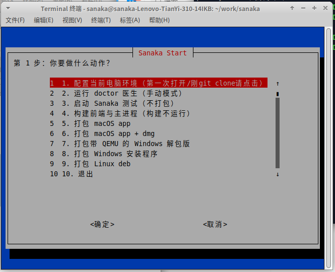
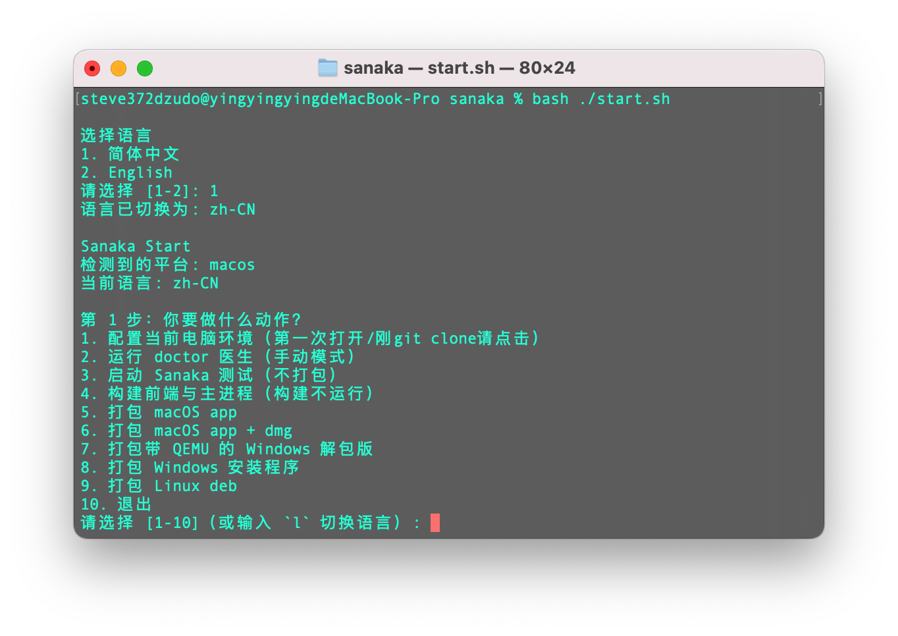

<div align="center">


# Sanaka

精致 QEMU 虚拟机管理软件前端


[](https://github.com/steve372a/pier)
[-brightgreen)]()
[]()


</div>

## 💗特点

| 超级跨平台！ | 统一界面 | 内置显示器 | 支持增强工具 |
| --- | --- | --- | --- |
| 支持 macOS/Linux/Windows | 通过 Electron 实现界面统一 | 内置 noVNC 并突破声音传输限制 | 只需安装Sanaka增强功能包，就能支持双方剪贴板共享 |

## 支持系统

| macOS | Windows | Linux |
| --- | --- | --- |
| 至少 macOS 15 Sequoia | 至少 Windows 10 | 建议 QEMU 版本 >= 8.2.0 |

## 🚀 快速上手

前往 [Releases](https://github.com/steve372a/sanaka/releases) 下载最新版适合您系统的包。

**Linux 版本需要安装以下依赖：**

```
sudo apt install qemu-system qemu-utils ovmf qemu-block-extra
```

## 📦 源码构建

参见 [从零开始的构建指南](./docs/guides/从零开始的构建指南.md)

我为您提供了快速工具！
您可以在本地快速上手：

```
git clone https://github.com/steve372a/sanaka.git
cd sanaka
bash start.sh
```

<div align="center">

</div>

**从源码打包全流程（macOS）：**

* 创建一个目录
* 输入 `git clone https://github.com/steve372a/sanaka.git` 
* `cd sanaka`进入目录，然后输入`bash start.sh`：



* 选择第一步，Sanaka 将为你自动配置好 Sanaka 需要的环境，包括 npm install 等。

## 📚 文档入口

- [从零开始的构建指南](./docs/guides/从零开始的构建指南.md)
- [给人的构建方法](./docs/guides/给人的构建方法.md)
- [感想](./docs/journal/感想.md)

## 🩺 环境修复

建议你直接运行：

```bash
bash scripts/doctor.sh
```

它会测速多个 npm / Electron 镜像，确认后帮你切换，并自动尝试修复依赖与构建问题。

## Sanaka 的内部...

<div align="center">

</div>

这是 **Sanaka SVM/SAKA 格式的机器包**：点击后，Sanaka就会立刻配置好虚拟机。
