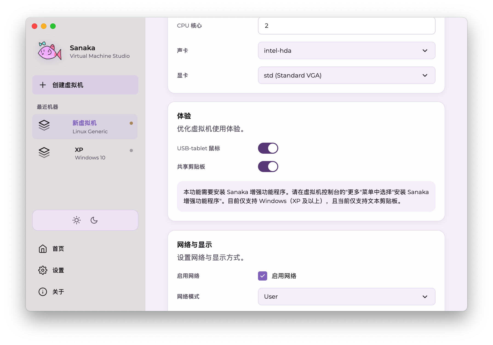
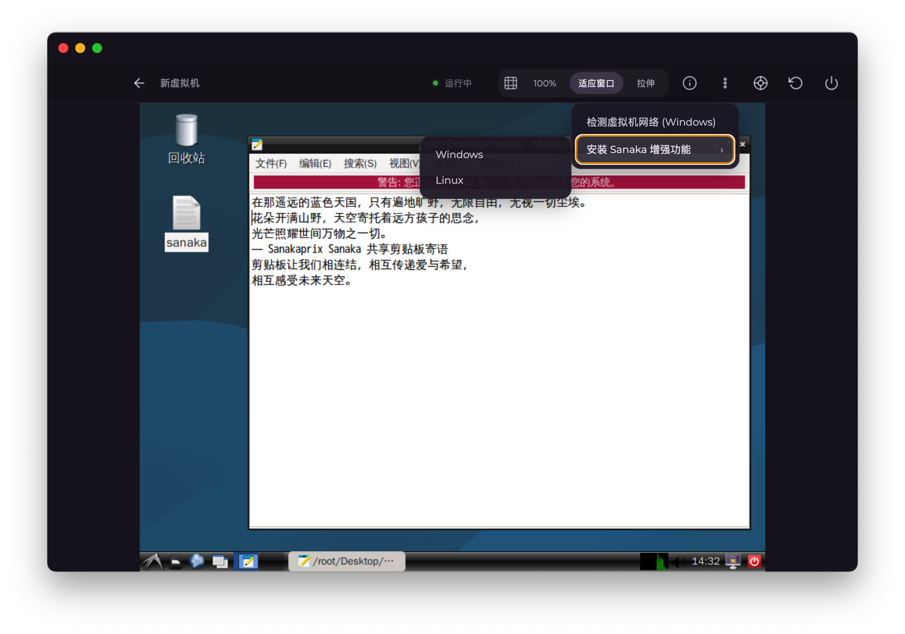
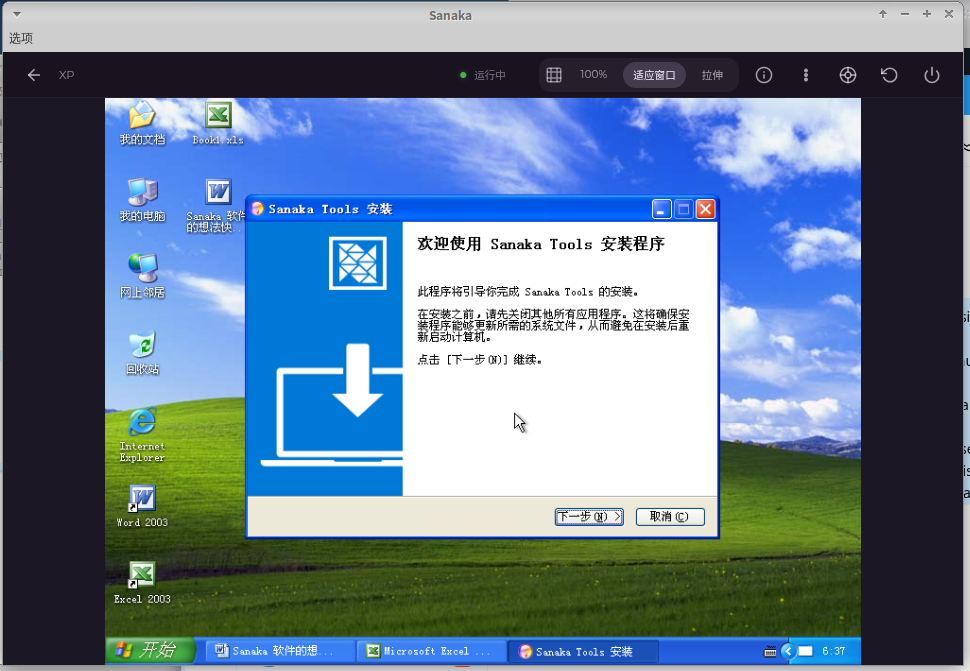
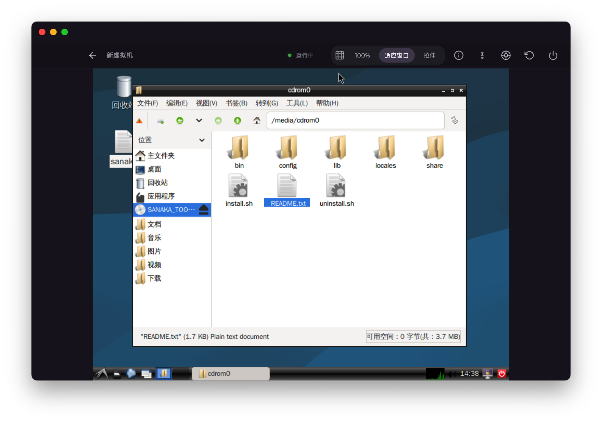
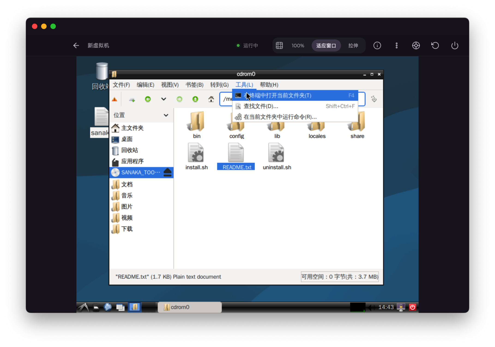

# 安装共享剪贴板/其他 Sanaka 增强功能客户端

Sanaka 增强功能是沟通双方的桥梁，要想让虚拟机支持和宿主机进行连结，需要安装 Sanaka 增强功能包。



* 新创建的虚拟机一般都会自动开启剪贴板共享功能，建议你在安装增强功能包前检查 Sanaka 虚拟机配置中是否开启此功能，以免无法使用。

请点击"..."更多按钮，选择“安装 Sanaka 增强功能“，选择虚拟机操作系统。



点击后，**光盘**会被挂载成增强功能包，此时，Windows 系统可能会自动打开安装程序，直接下一步即可。如果没有自动打开程序，可点击“我的电脑”，找到并进入光盘驱动器，点击setup.exe，开始安装。



* 如果是 Linux 虚拟机，可能需要手动挂载光盘，
你可以尝试：
```
mount /dev/sr0 /mnt/cdrom/
cd /mnt/cdrom
```
然后输入：
```
bash install.sh
```


* 如果是带有**桌面环境**的 Linux 虚拟机，可能系统会自动为你挂载好，你只需要用终端打开当前文件夹，然后输入：
```
bash install.sh
```


运行 install.sh，安装程序会自动帮你探测依赖、环境。自动帮你完成安装。安装完成后，可按照安装程序给出的指引启动共享剪贴板客户端。